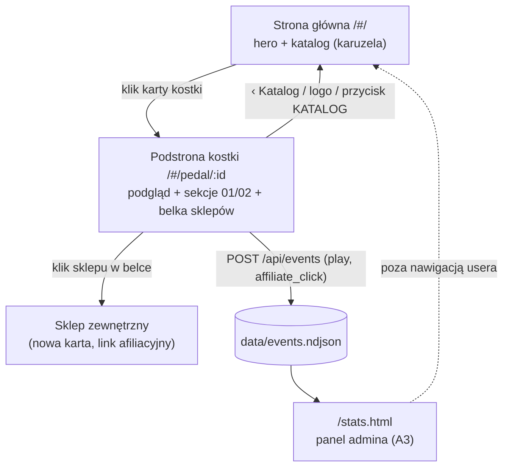
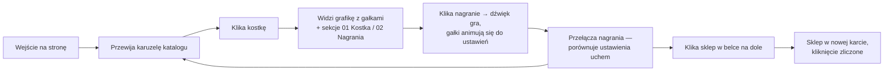

# UX_ARCHITECTURE — PedalTest Studio

## 1. Architektura informacji

## 2. User flows

### Flow 1 — Core: odsłuch kostki (gość)

### Flow 2 — Admin: dodanie kostki (bez panelu w UI)

1. Przygotowuje grafikę kostki, dane, układ gałek (ułamki x/y/size), nagrania (2/6/9), linki sklepów.
2. Dodaje wpis do `app/data/pedals.json`, grafikę do `app/public/img/`, audio do `app/data/audio/<id>/`.
3. Odświeża stronę — kostka w katalogu. Instrukcja krok po kroku: [`../app/README-admin.md`](../app/README-admin.md).

## 3. Język wizualny (design system „Knobyfier")

| Token | Wartość |
|-------|---------|
| Kolory | biel `#ffffff`, czerń `#111111`, **zieleń `#2e7d32`** (jedyny akcent), szarość `#6b7280`, obramowania `#e5e5e5`, scena podglądu `#0c0c0c` + szara podłoga |
| Nagłówki | **Oswald** (condensed) 500–700, uppercase, letter-spacing 1–4px |
| Tekst | **Inter** 400–700 |
| Przyciski | prostokątne, radius 3px; wypełnione zielenią (akcja główna) lub outline 2px (pozostałe) |
| Sekcje panelu | numerowane `01`, `02`… w zieleni + tytuł Oswald + wartość bieżąca po prawej |
| Karty/tabele | białe, cienkie obramowania 1px, bez cieni; hover: zielone obramowanie |

Układ podstrony kostki: belka nav (góra) / ciemny podgląd (lewa) / panel sekcji (prawa) /
stała belka sklepów (dół).

## 4. Dostępność (WCAG 2.1)

Zaimplementowane:

- Wszystkie elementy interaktywne to natywne `<button>`/`<a>` — pełna obsługa klawiatury (Tab/Enter).
- Widoczny fokus: `:focus-visible` z zielonym outline na kartach, nagraniach, strzałkach, linkach.
- `aria-label` na strzałkach karuzeli i kartach kostek; `alt` na grafikach kostek i logo.
- Kontrasty: czerń `#111` na bieli (≈18:1), zieleń `#2e7d32` na bieli (≈5.4:1 — AA dla tekstu),
  biały tekst na zieleni (AA dla dużego tekstu/przycisków).
- Stan odtwarzania komunikowany ikoną ▶/❚❚ + kolorem + etykietą bieżącego nagrania
  w nagłówku sekcji 02 (nie tylko kolorem).

Backlog a11y:

- [ ] `aria-pressed`/`aria-live` dla stanu odtwarzania (czytniki ekranu)
- [ ] `prefers-reduced-motion` — wyłączenie animacji obrotu gałek
- [ ] Audyt czytnikiem ekranu (VoiceOver) ścieżki Flow 1
